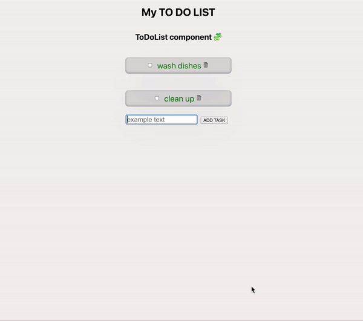

# About
To Do List App is a single page application where the user can create, delete, finish the task.

## Build with:
* "react": "^18.2.0"
* "express": "^4.18.2"

## Getting Started

1. Clone the repository from GitHub
2. Install dependencies in the project directory
```sh
npm install
```
3. In the project directory run

```sh
npm start
```
4. Open the application on [http://localhost:3000](http://localhost:3000) in your web browser


### DEMO

